# ARCHITECTURE.md — DevEco hvigor Performance Measurer

**Document ID:** ARCH-DEVECO-MEASURER-001
**Version:** 1.0.0
**Status:** Draft for Review
**Date:** 2026-04-12
**Classification:** Internal — Engineering Use Only

---

## Table of Contents

1. [Architectural Style and Principles](#1-architectural-style-and-principles)
2. [System Context and Boundaries](#2-system-context-and-boundaries)
3. [Component Architecture](#3-component-architecture)
4. [Data Flows and State](#4-data-flows-and-state)
5. [Cross-Platform Monitoring Layer](#5-cross-platform-monitoring-layer)
6. [OHOS SDK Management Mechanism](#6-ohos-sdk-management-mechanism)
7. [Technology Stack with Rationale](#7-technology-stack-with-rationale)
8. [Observability and Logging](#8-observability-and-logging)
9. [CI/CD and Deployment Topology](#9-cicd-and-deployment-topology)
10. [Scalability and Extensibility](#10-scalability-and-extensibility)
11. [Architectural Risks and Mitigation](#11-architectural-risks-and-mitigation)
12. [Roadmap and Evolution](#12-roadmap-and-evolution)

---

## 1. Architectural Style and Principles

### 1.1 Design Philosophy

The DevEco hvigor Performance Measurer is an **external observer** system. It never modifies `hvigor`, DevEco Studio, or project source code. All instrumentation is side-effect-free by design (aside from controlled process spawning and OS-level metric polling).

### 1.2 Core Principles

| Principle | Application |
|-----------|-------------|
| **Modularity** | Strict separation of concerns: build execution, metric sampling, SDK lifecycle, aggregation, storage, and export are independent components communicating through well-defined interfaces. Each component is testable in isolation via dependency injection. |
| **Separation of Concerns** | The Orchestrator knows *what* to run and *when*; the Process Monitor knows *how* to sample; the Metrics Aggregator knows *how* to reduce samples. No component reaches into another's internal state. |
| **Observability** | Every component emits structured events (JSON lines) that feed into the tool's own telemetry pipeline. The tool measures itself: overhead, sample gaps, restart count, and DB write latency are first-class metrics. |
| **Idempotency** | Every `run` generates a unique `run_id` (UUIDv4); no overwrite semantics. SDK installation verifies checksums and skips already-present versions. Export operations are read-only against the SQLite database. |
| **Graceful Degradation** | If a metric is unavailable (e.g., PSS in Windows strict mode, a short-lived child process that exits between samples), the system emits `null` with a warning, completes the run, and reports `metric_completeness_pct`. Runs are never aborted solely due to partial metric loss. |
| **Deterministic Reproducibility** | Given identical inputs (project, SDK version, OS, environment), two runs produce statistically indistinguishable aggregates (±5% p50/p90, ±8% p99 per NFR-ACC-02). All environment variables, resolved paths, and versions are captured in the metadata block. |

### 1.3 Architectural Decision Records (ADRs)

| ADR | Decision | Status |
|-----|----------|--------|
| ADR-001 | Sampling over instrumentation (eBPF/ETW) | **Accepted** — cross-platform, lower complexity |
| ADR-002 | SQLite as default storage (vs. InfluxDB/Prometheus) | **Accepted** — zero-config, portable, sufficient for single-host |
| ADR-003 | CLI-only interface (no built-in web UI) | **Accepted** — fits CI/CD; visualization deferred to consumers |
| ADR-004 | Python ≥ 3.10 as implementation runtime | **Accepted** — `psutil` provides unified cross-platform memory metrics; `asyncio` handles concurrent sampling |
| ADR-005 | PSS approximation on Windows via formula `Private + (WS - Private) / N_shared` | **Accepted** — ±5–7% error documented; `--metric-mode strict` emits `null` |

---

## 2. System Context and Boundaries

### 2.1 C4 Level 1 — System Context

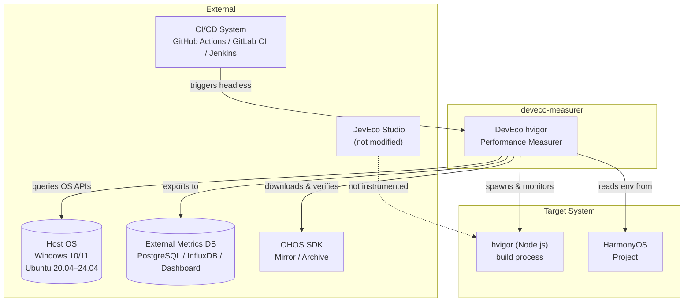

### 2.2 System Boundaries

| Boundary | In-Scope | Out-of-Scope |
|----------|----------|--------------|
| **hvigor process tree** | Root `node` executing `hvigorw.js` + all descendants via recursive PID enumeration | Other Node processes on the host; DevEco Studio IDE process |
| **OHOS SDK** | Download, verify, isolate, switch versions; env-var injection | Modification of SDK contents; SDK internal build logic |
| **OS interaction** | Process enumeration, memory APIs, signal handling, Job Objects (Windows), `/proc` (Linux) | Kernel module loading, driver installation, system-wide configuration changes |
| **CI/CD** | Headless CLI invocation, exit codes, machine-readable output | CI pipeline definition, artifact upload logic, notification routing |
| **Data storage** | Internal SQLite DB, JSON/CSV/SQL export, optional push to PostgreSQL/MySQL | Dashboard hosting, alerting pipeline, long-term data retention policy |

### 2.3 Integration Contracts

| Integration | Contract | Direction |
|-------------|----------|-----------|
| `hvigor` invocation | `node $NODE_OPTIONS <hvigor_path>/bin/hvigorw.js $HVIGOR_OPTIONS` | Tool → hvigor |
| OS metric query | `/proc/<pid>/smaps` (Linux) or `psutil` (Windows) | OS → Tool |
| SDK provisioning | SHA-256 verified download → `~/.deveco-measurer/sdks/<ver>/sdk/` | SDKMirror → Tool |
| Export output | JSON array / CSV rows / SQL INSERTs with `schema_version` | Tool → consumer |
| CI trigger | `deveco-measurer run ...` exits 0/1/2 with structured stderr | CI ← Tool |

---

## 3. Component Architecture

### 3.1 C4 Level 2 — Container (Component) Diagram

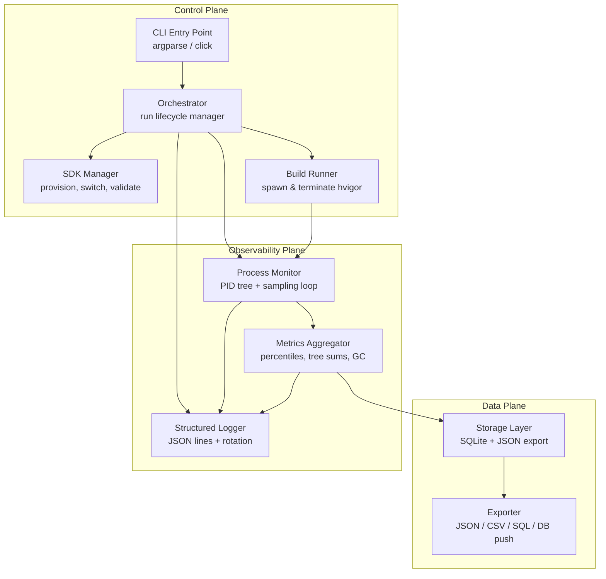

### 3.2 Component Responsibilities

#### 3.2.1 Orchestrator

| Aspect | Detail |
|--------|--------|
| **Responsibility** | Coordinates the full run lifecycle: pre-flight checks → SDK resolution → build execution → metric collection → aggregation → storage → post-run reporting |
| **Interface** | `Orchestrator.run(config: RunConfig) -> RunResult` |
| **State** | Immutable `RunConfig` (project path, SDK version, build target, timeouts, output path); mutable `RunContext` (run_id, start_time, status) |
| **Failure mode** | Catches exceptions from sub-components, maps to `RunStatus` (SUCCESS / FAILED / INVALID / TIMEOUT), ensures partial results are flushed |
| **Dependencies** | SDK Manager, Build Runner, Process Monitor, Metrics Aggregator, Storage, Logger |

#### 3.2.2 SDK Manager

| Aspect | Detail |
|--------|--------|
| **Responsibility** | Manages the SDK registry at `~/.deveco-measurer/sdks/`; handles download, checksum verification, extraction, `.env` generation, version switching, and pruning |
| **Interface** | `SDKManager.install(version, url) → None`; `SDKManager.use(version) → EnvSnapshot`; `SDKManager.validate(version) → ValidationResult` |
| **Isolation strategy** | Each version in isolated subdirectory; environment resolution merges `.env` into process env without mutating project files |
| **Integrity** | SHA-256 of `metadata.json` + critical binaries; corruption blocks runs unless `--force` |

#### 3.2.3 Build Runner

| Aspect | Detail |
|--------|--------|
| **Responsibility** | Spawns `node $NODE_OPTIONS <hvigor_path>/bin/hvigorw.js $HVIGOR_OPTIONS` as a subprocess, captures and returns `root_pid` immediately, then blocks on `wait()` until build exits. Streams stdout/stderr, enforces timeout, returns exit code |
| **Interface** | Two-phase: `BuildRunner.spawn(cmd, env) -> root_pid`; `BuildRunner.wait(timeout) -> BuildResult {exit_code, stdout, stderr, duration_ms}` |
| **Timeout handling** | Linux: SIGTERM → 10s grace → SIGKILL; Windows: `TerminateJobObject` → 10s grace → `TerminateProcess` |
| **Pre-run** | Optionally runs `clean` target unless `--skip-clean` |

#### 3.2.4 Process Monitor

| Aspect | Detail |
|--------|--------|
| **Responsibility** | At each sampling interval (default 250ms), enumerates the full PID tree rooted at the `node` process executing `hvigorw.js`, captures RSS/PSS/USS/CPU per process |
| **Interface** | `ProcessMonitor.start(root_pid, interval_ms) -> SamplingStream`; `ProcessMonitor.stop() -> FinalSamples` |
| **Tree discovery** | Linux: parse `/proc/<pid>/stat` for ppid; Windows: `psutil` process enumeration + parent matching |
| **Root validation** | Command-line matching (`/proc/<pid>/cmdline` or `Win32_Process.CommandLine`) must contain `hvigorw.js`; spawn timestamp correlation (±2s tolerance) |
| **Overhead control** | Sampling thread bounded to ≤2% CPU; batch reads per interval; buffered writes |

#### 3.2.5 Metrics Aggregator

| Aspect | Detail |
|--------|--------|
| **Responsibility** | Reduces raw samples into min/max/mean/p50/p90/p95/p99/sum/peak per metric per process and for the tree aggregate; computes GC summary from `--trace-gc` events |
| **Interface** | `MetricsAggregator.aggregate(samples: SamplingStream) -> AggregateResult` |
| **Tree peak memory** | `max(t) Σ memory_i(t)` across synchronized sample timestamps (not sum of individual peaks) |
| **GC parsing** | Line-by-line parsing of stderr for `--trace-gc` output; produces `{phase, timestamp_us, duration_us, heap_type, bytes_before, bytes_after}` |

#### 3.2.6 Storage / Exporter

| Aspect | Detail |
|--------|--------|
| **Responsibility** | Persists runs, processes, samples, GC events, and aggregates to SQLite; exports to JSON/CSV/SQL; optionally pushes to PostgreSQL/MySQL |
| **Interface** | `Storage.save(run_result) -> run_id`; `Exporter.export(run_id\|filter, format, output_path) -> None` |
| **Schema versioning** | Every record includes `schema_version` (semver); exports validated against JSON Schema |
| **Idempotency** | Writes are append-only; no overwrite of existing `run_id` |

### 3.3 Internal Package Structure

```
deveco-measurer/
├── src/
│   ├── __init__.py
│   ├── cli/                    # CLI entry point, argument parsing
│   │   ├── __init__.py
│   │   ├── commands/           # run, schedule, sdk, export, report
│   │   │   ├── run.py
│   │   │   ├── schedule.py
│   │   │   ├── sdk.py
│   │   │   ├── export.py
│   │   │   └── report.py
│   │   └── parser.py           # Argument definitions
│   ├── orchestrator/           # Run lifecycle coordination
│   │   ├── __init__.py
│   │   ├── orchestrator.py
│   │   ├── config.py           # RunConfig, defaults, validation
│   │   └── lifecycle.py        # Pre-flight, run, post-run hooks
│   ├── sdk_manager/            # SDK provisioning & switching
│   │   ├── __init__.py
│   │   ├── registry.py         # registry.json CRUD
│   │   ├── downloader.py       # HTTP download + SHA-256 verify
│   │   ├── extractor.py        # Archive extraction
│   │   ├── env_resolver.py     # .env generation & merge
│   │   └── validator.py        # Integrity & compatibility checks
│   ├── build_runner/           # hvigor execution
│   │   ├── __init__.py
│   │   ├── runner.py           # Spawn, stream capture, timeout
│   │   ├── signals.py          # OS-specific termination
│   │   └── gc_parser.py        # --trace-gc stderr parser
│   ├── process_monitor/        # PID tree + sampling
│   │   ├── __init__.py
│   │   ├── monitor.py          # Sampling loop orchestration
│   │   ├── tree_builder.py     # PID tree discovery
│   │   ├── sampler.py          # Per-sample metric capture
│   │   └── platform/           # OS-specific abstractions
│   │       ├── __init__.py
│   │       ├── linux.py        # /proc parsing
│   │       └── windows.py      # psutil + WinAPI wrappers
│   ├── metrics/                # Aggregation & statistics
│   │   ├── __init__.py
│   │   ├── aggregator.py       # Percentile computation
│   │   ├── tree_aggregate.py   # Tree-level peak & sums
│   │   └── stats.py            # Linear interpolation helpers
│   ├── storage/                # SQLite persistence
│   │   ├── __init__.py
│   │   ├── database.py         # Connection management, migrations
│   │   ├── schema.py           # SQL DDL
│   │   └── writer.py           # Batch insert logic
│   ├── export/                 # Data export
│   │   ├── __init__.py
│   │   ├── json_export.py
│   │   ├── csv_export.py
│   │   ├── sql_export.py
│   │   └── db_push.py          # PostgreSQL/MySQL connector
│   └── logging/                # Structured logging
│       ├── __init__.py
│       ├── logger.py           # JSON lines + stderr dual output
│       └── rotation.py         # Log file rotation at 10 MB
├── tests/
├── scripts/
└── pyproject.toml
```

---

## 4. Data Flows and State

### 4.1 Sequence Diagram — Full Run Lifecycle

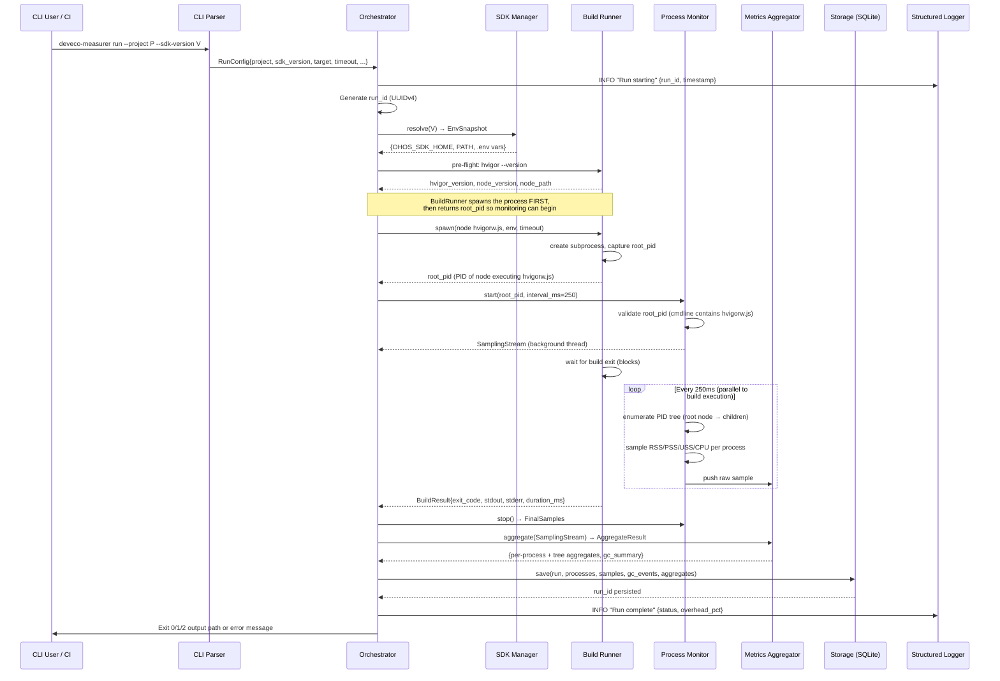

### 4.2 State Machine — Run Lifecycle

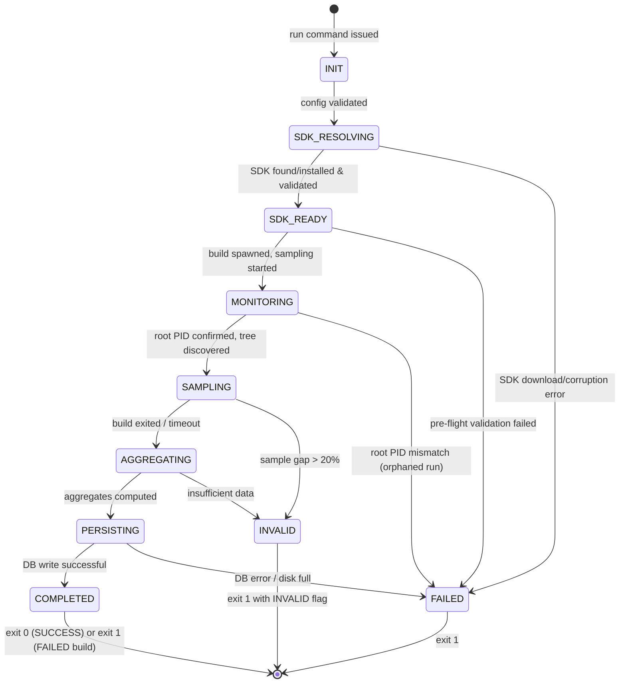

### 4.3 Metric Processing Pipeline

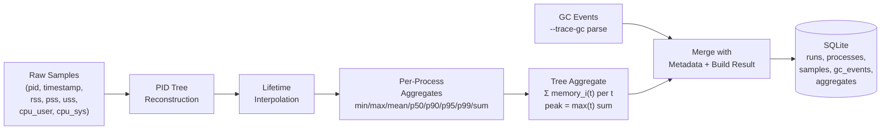

### 4.4 Data Consistency Guarantees

| Guarantee | Mechanism |
|-----------|-----------|
| **Append-only writes** | All INSERTs; no UPDATE on metrics tables |
| **Atomic run commit** | SQLite transaction wraps run + processes + samples + aggregates; rollback on failure |
| **Orphan prevention** | `run_id` foreign keys with `ON DELETE CASCADE`; partial runs flagged as INVALID |
| **Schema evolution** | `PRAGMA user_version` checked on open; migration scripts applied before writes |

---

## 5. Cross-Platform Monitoring Layer

### 5.1 OS Abstraction Architecture

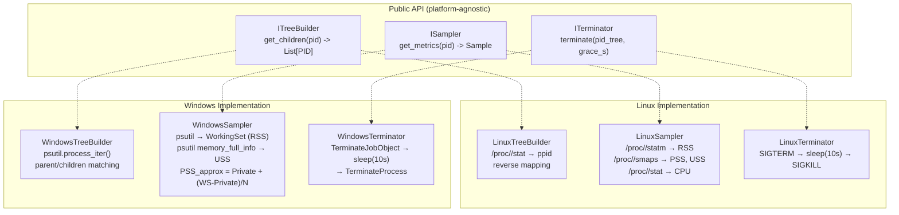

### 5.2 Metric Source Mapping

| Metric | Linux Source | Windows Source | Parity Notes |
|--------|-------------|----------------|--------------|
| **RSS** | `/proc/<pid>/statm` × page_size | `psutil.Process().memory_info().rss` | Directly comparable; both represent working set |
| **PSS** | `/proc/<pid>/smaps` — Σ(Rss / shared_count) | `PSS_approx = Private_Bytes + (Working_Set - Private_Bytes) / N_shared_processes` | Windows error ±5–7%; documented in reports; `--metric-mode strict` → `null` |
| **USS** | `/proc/<pid>/smaps` — Σ(Private_*) | `psutil.Process().memory_full_info().uss` | Native on both; `psutil ≥ 6.0` required; comparable within ±2% |
| **CPU user** | `/proc/<pid>/stat` utime × tick | `psutil.Process().cpu_times().user` | Both in seconds; microsecond internal representation |
| **CPU system** | `/proc/<pid>/stat` stime × tick | `psutil.Process().cpu_times().system` | Both in seconds; microsecond internal representation |

### 5.3 Process Tree Discovery Algorithm

```
1. Capture root_pid = PID of spawned `node` process
2. Validate root_pid:
   a. Read command line (Linux: /proc/<pid>/cmdline; Windows: psutil cmdline)
   b. Confirm contains `hvigorw.js`
   c. Confirm spawn timestamp within ±2s of launch time
3. At each sampling interval:
   a. Enumerate all processes (Linux: scan /proc; Windows: psutil.process_iter())
   b. Build parent→children map
   c. BFS/DFS from root_pid to collect transitive descendants
   d. Filter: exclude PID < 100 (Linux) and System/Idle (Windows)
   e. For each live PID, capture Sample(rss, pss, uss, cpu_user, cpu_sys, timestamp)
   f. Track new PIDs (record start_time) and vanished PIDs (record end_time, last_sample)
4. On build exit: stop sampling, flush final samples for still-live PIDs
```

### 5.4 Sampling Frequency vs. Overhead Analysis

| Interval | Expected Overhead | Capture Accuracy | Recommended Use |
|----------|-------------------|------------------|-----------------|
| 100ms | 2.5–3.5% | Captures processes alive ≥100ms | High-precision lab measurements |
| 250ms (default) | 1.0–1.8% | Captures processes alive ≥250ms | General use; meets ≤3% NFR |
| 500ms | 0.5–0.9% | Misses sub-500ms workers | Low-overhead CI runs |
| 1000ms | 0.2–0.5% | Misses sub-1s workers; significant gap risk | Not recommended; available for stress tests |

**Overhead measurement:** The tool computes `overhead_pct = (instrumented_time - baseline_time) / baseline_time × 100` and includes it in every run's metadata. If `overhead_pct > 3`, a warning is logged and included in the export.

### 5.5 Platform-Specific Edge Cases

| Edge Case | Platform | Handling |
|-----------|----------|----------|
| `/proc/<pid>/smaps` returns 0 for shared fields (hardened kernel with `ptrace` restriction) | Linux | Log warning; emit `null` for PSS; USS still available from `Private_*` lines |
| Short-lived process (< sampling interval) spawns and exits | Both | Not captured; acceptable per NFR-ACC-02; documented in report as `sample_gap_pct` |
| Antivirus/Defender scan hooks inflate I/O wait | Windows | Log warning; recommend exclusion for project build directories |
| Root `node` process exits but child `javac`/`aapt` persists | Both | Warn; `--kill-orphans` flag terminates subtree; run marked INVALID if root lost before build exit |

---

## 6. OHOS SDK Management Mechanism

### 6.1 SDK Directory Layout

> ⚠ **The internal structure of the SDK archive is determined by Huawei and may change between versions.**
> The layout below reflects typical 5.x–6.x releases. The SDK Manager does **not** hardcode paths inside
> the archive; instead it relies on a *manifest file* (`sdk_manifest.json`) that declares the locations of
> critical components (`hvigor`, `build-tools`, `toolchains`). If no manifest is present, a fallback
> structure (shown below) is used.

```
~/.deveco-measurer/
└── sdks/
    ├── 5.0.3.900/
    │   ├── sdk/                  # Full extracted SDK tree
    │   │   ├── build-tools/
    │   │   ├── hvigor/
    │   │   │   └── bin/
    │   │   │       └── hvigorw.js
    │   │   ├── toolchains/
    │   │   └── ...
    │   ├── sdk_manifest.json     # {hvigor_path, build_tools_path, toolchains_path, ...} — provided by Huawei or auto-generated
    │   ├── metadata.json         # {version, sha256, install_date, source_url, size_bytes, build_origin}
    │   └── .env                  # OHOS_SDK_HOME=...; PATH=...; version-specific vars
    ├── 6.0.0.100/
    │   ├── sdk/
    │   ├── sdk_manifest.json
    │   ├── metadata.json
    │   └── .env
    └── registry.json             # {installed_versions: [...], active_version: "5.0.3.900"}
```

### 6.1.1 OHOS SDK Sources

| Source | Description | SDK Build Host Platform |
|--------|-------------|------------------------|
| **Huawei SDK Mirror** | Official archives published by Huawei. Downloaded over HTTPS with SHA-256 verification. | — |
| **Local build (native)** | SDK built from source on Ubuntu. Native build targeting Linux. | Ubuntu 20.04–24.04 (x86_64/aarch64) |
| **Local build (cross, Windows)** | SDK built on Ubuntu via **MinGW** cross-compilation targeting Windows. The resulting archive is structurally equivalent to the official SDK. | Ubuntu 20.04–24.04 → Windows 10/11 (x86_64) |

The SDK Manager supports both scenarios via:

```
deveco-measurer sdk install --from-file <sdk-archive.tar.gz> --target-os linux|windows
```

The `--target-os` flag allows registering a cross-compiled SDK with the correct target-OS binding. When a benchmark run requests `--sdk-version`, the tool checks target-OS compatibility between the SDK and the runner's host OS (warns on mismatch).

### 6.2 SDK Provisioning Flow

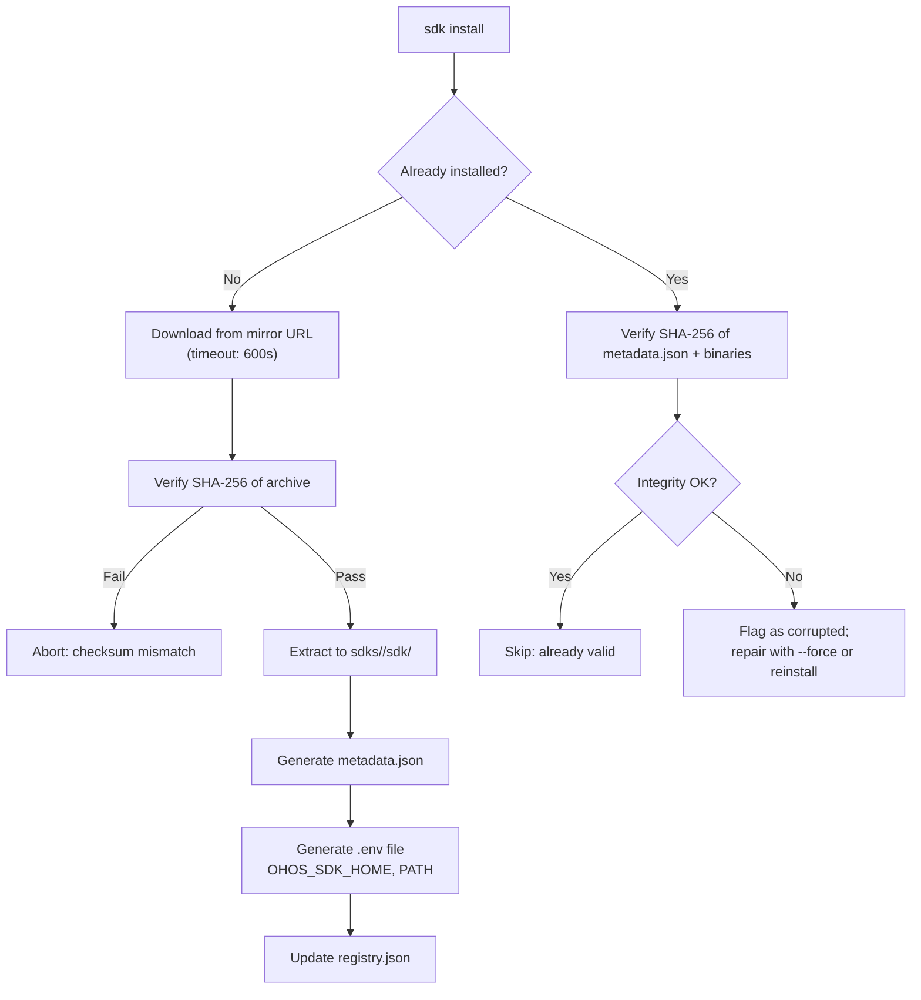

### 6.3 Environment Resolution at Runtime

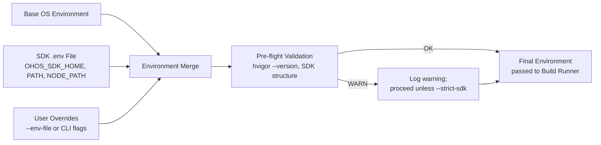

### 6.4 SDK Caching and Integrity

| Aspect | Strategy |
|--------|----------|
| **Download caching** | Archive stored in `~/.deveco-measurer/cache/` during install; deleted after successful extraction |
| **Integrity verification** | SHA-256 of `metadata.json` computed at install time and verified on every `sdk validate` or pre-run check |
| **Corruption detection** | If SHA-256 mismatch detected, SDK flagged as `CORRUPTED` in registry; runs blocked unless `--force` |
| **Disk space management** | Pre-install check: ≥2× SDK size free required; `sdk prune` removes versions unused ≥30 days |
| **Offline installation** | `sdk install --from-file <archive.tar.gz>` bypasses download; still verifies checksum |

### 6.5 Version Switching

| Operation | Effect |
|-----------|--------|
| `deveco-measurer sdk use <ver>` | Updates `registry.json` → `active_version`; subsequent runs use this version |
| `deveco-measurer run --sdk-version <ver>` | One-time override for this run; does **not** mutate `registry.json` |
| `deveco-measurer sdk list` | Enumerates installed versions with integrity status and last-used date |
| `deveco-measurer sdk prune` | Removes versions not used in ≥30 days (configurable) |

---

## 7. Technology Stack with Rationale

### 7.1 Core Runtime

| Technology | Version | Rationale | Rejected Alternatives |
|------------|---------|-----------|----------------------|
| **Python** | ≥ 3.10 | `psutil` provides unified cross-platform process/memory metrics; `asyncio` for concurrent sampling; `sqlite3` in stdlib; `argparse` for CLI; rich ecosystem; no native compilation required | **Node.js** — would need native addons for `/proc` parsing on Linux; `psutil` equivalent (`pidusage`) lacks PSS/USS. **Go** — excellent cross-platform but requires CGO for some Windows APIs; larger binary distribution. **Rust** — same CGO concerns; overkill for this scope |
| **psutil** | ≥ 6.0.0 | Native USS on Windows via `memory_full_info().uss`; cross-platform process tree; no native compilation at install time | **Manual /proc + ctypes WinAPI** — higher maintenance burden; psutil abstracts edge cases (permission errors, zombie processes) |
| **argparse** | stdlib | No external dependency; mature; auto-generates `--help` | **click / typer** — additional dependency; not justified for ≤5 subcommands |

### 7.2 Data Storage

| Technology | Rationale | Rejected Alternatives |
|------------|-----------|----------------------|
| **SQLite** (stdlib `sqlite3`) | Zero-config, single-file, portable, ACID transactions, sufficient throughput for single-host runs (~1000 samples/run) | **InfluxDB** — requires server daemon, overkill for single-host. **Prometheus** — pull-based model incompatible with push-from-agent. **Flat JSON files** — no query capability; schema enforcement requires custom code |

### 7.3 Export & Integration

| Technology | Rationale |
|------------|-----------|
| **JSON** (stdlib `json`) | Universal interchange format; JSON Schema validation available |
| **CSV** (stdlib `csv`) | Spreadsheet/BI compatibility |
| **SQLAlchemy** (optional) | For PostgreSQL/MySQL push; abstracts dialect differences |

### 7.4 Logging & Observability

| Technology | Rationale |
|------------|-----------|
| **Python `logging` + JSON formatter** | Stdlib; structured output via custom formatter; rotation via `RotatingFileHandler` |
| **JSON lines to `~/.deveco-measurer/logs/`** | Machine-parseable; compatible with `jq`, ELK, Splunk |

### 7.5 Testing

| Technology | Rationale |
|------------|-----------|
| **pytest** | De facto Python test framework; fixtures for mock `/proc` trees |
| **unittest.mock** | Mock `psutil` calls, file system, subprocess |
| **hypothesis** | Property-based testing for aggregation percentiles |

### 7.6 Why Not Selected

| Alternative | Reason for Rejection |
|-------------|---------------------|
| **eBPF (Linux) / ETW (Windows)** | Kernel-level tracing; platform-specific; high complexity; violates cross-platform simplicity principle |
| **Docker containerization** | Build requires host OS toolchains (Gradle, NDK); containerizing adds overhead and may not reproduce native build behavior |
| **Web dashboard (built-in)** | Scope creep; CI/CD pipelines need CLI; visualization better served by Grafana/Metabase consuming exported data |
| **gRPC microservices** | Single-host tool; REST/gRPC adds deployment complexity with no benefit |

---

## 8. Observability and Logging

### 8.1 Logging Architecture

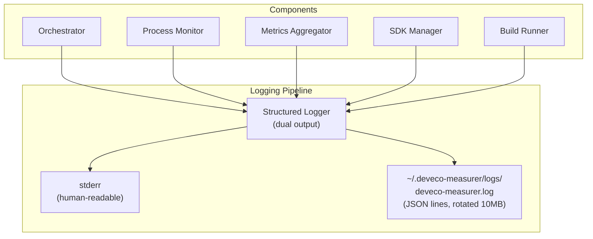

### 8.2 Log Levels and Use Cases

| Level | Target Audience | Use Cases |
|-------|----------------|-----------|
| **ERROR** | Operator, on-call | Unrecoverable failures (SDK corruption, DB corruption, permission denied, disk full) |
| **WARN** | Operator, analyst | Approximations used (Windows PSS), missing metrics, retries, timeout warnings, overhead > 3% |
| **INFO** | Operator, CI log | Run start/end, SDK switch, export completion, SDK install/validate |
| **DEBUG** | Developer, troubleshooter | Per-sample values, PID tree enumeration, environment variable dumps (redacted), GC event counts |
| **TRACE** | Core developer | Raw `/proc` responses, WinAPI return codes, SQL statements, HTTP download headers |

### 8.3 Structured Log Schema (JSON Lines)

```json
{
  "timestamp": "2026-04-12T10:00:00.123456Z",
  "level": "INFO",
  "component": "orchestrator",
  "event": "run_started",
  "run_id": "a1b2c3d4-...",
  "data": {
    "project": "/home/user/my-app",
    "sdk_version": "5.0.3.900",
    "build_target": "assembleDebug",
    "tool_version": "1.0.0",
    "os_name": "Linux",
    "os_version": "Ubuntu 22.04.3 LTS"
  }
}
```

### 8.4 Self-Monitoring Metrics

The tool measures itself to ensure it meets its own NFRs:

| Self-Metric | Collection Method | Alert Threshold |
|-------------|-------------------|-----------------|
| **Sampling overhead %** | `(instrumented_wall - baseline_wall) / baseline_wall × 100` | > 3% → WARN |
| **Sample gap %** | `(expected_samples - actual_samples) / expected_samples × 100` | > 20% → INVALID |
| **Collector CPU %** | `psutil.Process(os.getpid()).cpu_percent()` | > 2% single-core → WARN |
| **Collector memory RSS** | `psutil.Process(os.getpid()).memory_info().rss` | > 50 MB → WARN |
| **DB write latency** | Timer around SQLite INSERT batch | > 1s → WARN |
| **Restart count** | Counter of sampling thread restarts | > 0 → WARN |

### 8.5 Anomaly Detection (Post-Run)

| Anomaly | Detection Rule | Action |
|---------|---------------|--------|
| **Memory spike** | `peak_rss > 3 × mean_rss` for tree aggregate | Flag in report; possible OOM risk |
| **GC storm** | `gc_summary.pause_count > 50` in a single run | Flag in report; investigate hvigor/Node memory pressure |
| **Build time regression** | `build_duration_ms > 1.5 × p50_duration` for same project/SDK (computed from historical data in DB) | WARN; suggest `report trend` |
| **Sample gap anomaly** | `sample_gap_pct > 10` on otherwise successful run | WARN; possible monitoring overhead issue |

---

## 9. CI/CD and Deployment Topology

### 9.1 Deployment Model

The tool is a **single-host CLI application** deployed to each CI runner or developer workstation. There is no central server or daemon.

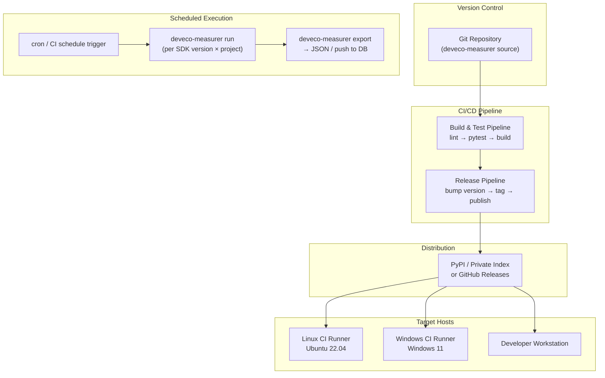

### 9.2 Installation & Distribution

| Method | Command | Use Case |
|--------|---------|----------|
| **pip install** | `pip install deveco-measurer` | Developer workstation; CI runners with Python |
| **pipx** | `pipx install deveco-measurer` | Isolated from system Python; recommended for dev machines |
| **Standalone wheel** | `pip install deveco_measurer-1.0.0-py3-none-any.whl` | Air-gapped CI runners |
| **Source** | `git clone && pip install -e .` | Development |

### 9.3 Versioning Strategy

| Aspect | Convention |
|--------|------------|
| **Tool version** | Semantic versioning (`MAJOR.MINOR.PATCH`); `--version` flag |
| **Schema version** | Independent semver in `metrics.db` (`1.0.0`); migration scripts for upgrades |
| **Git tags** | `v1.0.0`, `v1.1.0`; signed tags for releases |
| **Changelog** | `CHANGELOG.md` following [Keep a Changelog](https://keepachangelog.com/) |

### 9.4 CI Integration Patterns

#### GitHub Actions Example

```yaml
name: hvigor Performance Benchmark
on:
  schedule:
    - cron: '0 2 * * 1-5'  # Weekdays at 02:00 UTC
  workflow_dispatch:
    inputs:
      sdk_version:
        description: 'OHOS SDK version'
        required: true
        default: '5.0.3.900'

jobs:
  benchmark:
    runs-on: ubuntu-22.04
    steps:
      - uses: actions/checkout@v4
      - name: Install deveco-measurer
        run: pip install deveco-measurer
      - name: Install OHOS SDK
        run: deveco-measurer sdk install 5.0.3.900
      - name: Run benchmark
        run: |
          deveco-measurer run \
            --project ./samples/my-app \
            --sdk-version 5.0.3.900 \
            --target assembleDebug \
            --output ./results/
      - name: Upload results
        uses: actions/upload-artifact@v4
        with:
          name: benchmark-results
          path: ./results/
```

### 9.5 Agent Update & Rollback

| Operation | Mechanism |
|-----------|-----------|
| **Update** | `pip install --upgrade deveco-measurer`; schema auto-migration on first run |
| **Rollback** | `pip install deveco-measurer==<previous_version>`; schema downgrade not supported (forward-compatible reads) |
| **Canary** | Install to isolated venv on one runner; compare overhead and results against production version for 24h |
| **Compatibility** | New tool version reads old schema versions; old tool version can read new schema (ignores unknown columns) |

---

## 10. Scalability and Extensibility

### 10.1 Adding New Operating Systems

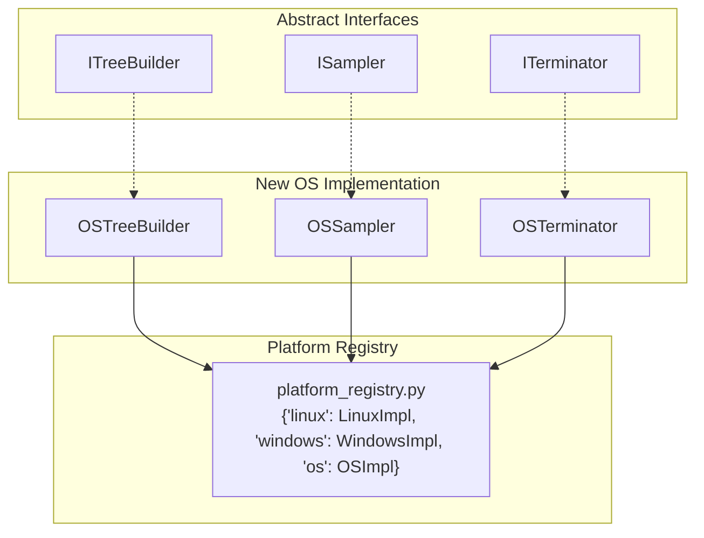

**Steps to add a new OS (e.g., macOS):**

1. Implement `MacOSTreeBuilder`, `MacOSSampler`, `MacOSTerminator` conforming to the `I*` interfaces
2. Register in `platform_registry.py` under key `darwin`
3. Add PSS approximation strategy (macOS has `proc_pidinfo` but no `/proc/smaps`); document error bounds
4. Add OS to NFR-CP-01 supported platforms list
5. Write unit tests with mocked macOS process APIs
6. Integration test on macOS CI runner

### 10.2 Adding New Metrics

| Metric | Extension Point | Effort |
|--------|----------------|--------|
| **CPU % per process** | Add to `Sample` dataclass; compute delta between consecutive `cpu_user` + `cpu_sys` samples | Low — data already collected |
| **Disk I/O (read/write bytes)** | Linux: `/proc/<pid>/io`; Windows: `GetProcessIoCounters` | Medium — requires new OS-specific source functions |
| **Network I/O** | Linux: `/proc/<pid>/net/dev` (per-process unreliable); consider `cgroups` or `nsenter` | High — Linux per-process network accounting is not reliable without `cgroups v2` |
| **GC heap generations** | Parse `--trace-gc` new-space / old-space events from stderr | Low — extension to existing `gc_parser.py` |
| **Build cache hit rate** | Parse hvigor stdout for cache-related log lines | Medium — hvigor log format coupling |
| **Thread count** | Linux: `/proc/<pid>/status` (`Threads:` line); Windows: `psutil.Process().num_threads()` | Low |

### 10.3 Export Plugins

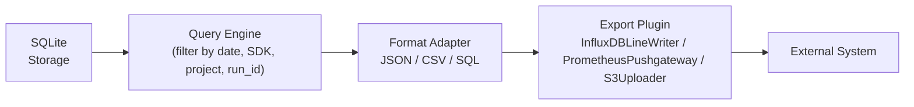

**Plugin interface:**

```python
class ExportPlugin(ABC):
    @abstractmethod
    def export(self, records: List[RunRecord], config: ExportConfig) -> ExportResult:
        """Export records to external system. Must be idempotent."""
```

Built-in plugins in v1.0: JSON, CSV, SQL export, PostgreSQL/MySQL push.
Future plugins: InfluxDB line protocol, Prometheus Pushgateway, Amazon S3, Grafana annotation API.

### 10.4 Parallel Runs

| Scenario | Approach |
|----------|----------|
| **Sequential SDK matrix** (default) | Run N SDK versions one at a time; total time = Σ(build_time_i) |
| **Parallel on multi-core runner** | `deveco-measurer run --project P --sdk-versions v1,v2,v3 --parallel`; each version in isolated subprocess with own env; results merged post-run |
| **Cross-project parallel** | CI matrix strategy: each matrix element runs tool independently; results collected as artifacts |
| **Resource contention** | Warning if parallel runs detected on same host; recommend `--cpu-affinity` to pin runs to specific cores |

---

## 11. Architectural Risks and Mitigation

### 11.1 Risk Register

| ID | Risk | Impact | Probability | Mitigation | Residual Risk |
|----|------|--------|-------------|------------|---------------|
| R-01 | **Monitoring overhead exceeds 3% NFR** | High — invalidates all metrics | Medium | Adaptive sampling interval (auto-increase if overhead detected); baseline comparison per run; WARN flag in output | Low — overhead measured and reported |
| R-02 | **PSS approximation error on Windows > 7%** | Medium — cross-platform comparison unreliable | Medium | Document error bounds per run; `--metric-mode strict` emits `null`; cross-validate on dual-boot systems; publish delta in release notes | Medium — accepted trade-off |
| R-03 | **hvigor spawn blocking via Job Object or anti-debug hooks** | High — tool cannot track process tree | Low | Fallback to process name + timestamp correlation; document limitation; `--kill-orphans` cleanup | Low — graceful degradation |
| R-04 | **Short-lived child processes missed between samples** | Low — minor undercount of peak memory | High | Document as known limitation; 100ms interval option; acceptable per ±5% NFR | Low — within tolerance |
| R-05 | **SQLite database corruption on crash** | High — data loss | Low | WAL mode enabled (`PRAGMA journal_mode=WAL`); atomic transactions; `--db-backup` flag for periodic copies | Low — WAL provides crash recovery |
| R-06 | **SDK mirror unavailability or archive corruption** | High — cannot run benchmarks | Medium | Multiple mirror URLs in config; SHA-256 verification; offline `--from-file` install; SDK caching | Low — multiple fallbacks |
| R-07 | **Antivirus/Defender inflating build times on Windows** | Medium — skewed metrics | Medium | Log warning; recommend exclusion directories; document in reports; baseline measured with same AV config | Medium — environmental factor |
| R-08 | **Schema evolution breaks backward compatibility** | Medium — old tool cannot read new DB | Low | Forward-compatible schema (additive columns only); `schema_version` check; migration scripts | Low — additive-only policy |
| R-09 | **Process tree race condition (root PID exits, children orphaned)** | Medium — incomplete metrics | Medium | Root PID liveness check every interval; if root exits, flush final samples for children; mark run INVALID if root lost before build exit | Low — detected and flagged |
| R-10 | **Metric divergence between OS for identical workload** | Medium — hard to compare Linux vs Windows results | High | Document OS-specific measurement methods; cross-platform parity tests (AC-05); report includes `measurement_methodology` per metric | Medium — inherent OS differences |

### 11.2 Degradation Modes

| Degradation | Symptom | Detection | Recovery |
|-------------|---------|-----------|----------|
| **Sampling thread starvation** | Sample gap > 20% | `sample_gap_pct` in run metadata | Restart sampling thread; if recurrent, increase interval |
| **DB write bottleneck** | Write latency > 1s | Timer around INSERT batch | Buffer samples in memory; flush at end of run (risk: crash data loss) |
| **Memory leak in collector** | Collector RSS grows > 50 MB | Self-monitoring metric | Log WARN; investigate; restart tool between runs |
| **Disk full** | I/O error on SQLite | Catch `sqlite3.OperationalError: database disk I/O error` | Abort run gracefully; log CRITICAL; do not corrupt DB |

---

## 12. Roadmap and Evolution

### 12.1 Phase Plan

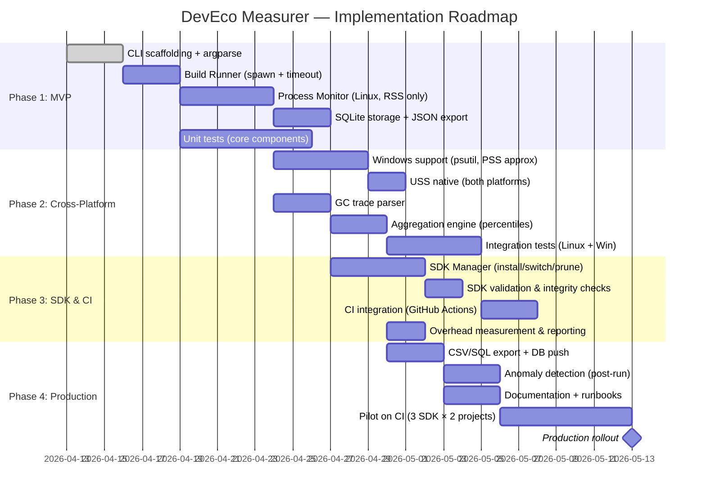

### 12.2 Phase Gates and Decision Points

| Gate | Criteria | Go/No-Go Decision |
|------|----------|-------------------|
| **Gate 1: MVP Complete** | CLI `run` works on Linux; RSS collected; JSON export functional; overhead measured | Proceed to Phase 2 if overhead ≤ 3% on 5-run baseline |
| **Gate 2: Cross-Platform Ready** | Windows runs produce valid results; PSS approximation documented; USS native on both; GC parsing functional | Proceed to Phase 3 if Windows PSS error ≤ 7% vs. dual-boot validation |
| **Gate 3: CI Integration** | SDK matrix (≥3 versions) runs headlessly on CI; results exported and importable; retries functional | Proceed to Phase 4 if reproducibility ±5% p50/p90 across 5 consecutive runs |
| **Gate 4: Production Readiness** | All acceptance criteria (AC-01 through AC-13) pass; pilot data collected for ≥2 projects; anomaly detection functional | **Production rollout** — tool declared stable for engineering-wide use |

### 12.3 Production Criteria

| Criterion | Threshold | Measurement |
|-----------|-----------|-------------|
| Monitoring overhead | ≤ 3% | Mean over 10 runs vs. baseline |
| Reproducibility | ±5% p50/p90, ±8% p99 | 5-run variance analysis |
| Cross-platform parity | ±15% RSS delta (Linux vs. Windows, same project) | Cross-platform benchmark |
| Long-run stability | 50 runs over 24h, 0 crashes, linear DB growth | CI endurance test |
| SDK matrix coverage | ≥ 3 versions supported, integrity verified | `sdk list` + `sdk validate` |
| Export compliance | JSON Schema valid; CSV headers correct; SQL executes | Automated export validation |
| Invalid run flagging | Correct status field on injected failures | Fault injection tests |

### 12.4 Future Evolution (Post-1.0)

| Feature | Phase | Rationale |
|---------|-------|-----------|
| **macOS support** | 1.1 | Developer demand; requires PSS strategy for macOS |
| **eBPF-based sampling (Linux)** | 2.0 | Sub-millisecond accuracy; eliminates sampling gap; kernel dependency |
| **Real-time dashboard** | 1.2 | Web UI reading from SQLite or pushed to Grafana |
| **Build cache analysis** | 1.1 | Parse hvigor cache hits/misses; track cache effectiveness over time |
| **Disk I/O metrics** | 1.2 | Per-process read/write bytes; identify I/O-bound build phases |
| **Regression alerting** | 1.2 | Auto-compare against historical p50; alert on > 20% regression |
| **Multi-project batch mode** | 1.1 | Run against project matrix in single command |
| **Git integration** | 1.1 | Auto-capture commit SHA, branch, PR number from CI env |

---

## Appendix A — Glossary

| Term | Definition |
|------|------------|
| **hvigor** | Node.js-based build system for HarmonyOS projects; invoked via `node <hvigor_path>/bin/hvigorw.js` |
| **OHOS SDK** | OpenHarmony/HarmonyOS Software Development Kit |
| **RSS** | Resident Set Size — total physical memory pages held in RAM |
| **PSS** | Proportional Set Size — RSS adjusted by shared page distribution |
| **USS** | Unique Set Size — memory pages exclusive to a process |
| **WAL** | Write-Ahead Logging — SQLite crash recovery mode |
| **Job Object** | Windows kernel object for grouped process management |
| **PID** | Process Identifier |
| **ADR** | Architectural Decision Record |

## Appendix B — Reference Documents

| Document | Link / Path |
|----------|-------------|
| Problem Statement | `doc/PROBLEM_STATEMENT.md` |
| Technical Specification | `doc/TECHNICAL_SPECIFICATION.md` |
| Node.js `--trace-gc` docs | <https://nodejs.org/api/cli.html#--trace-gc> |
| Linux `proc(5)` | `man 5 proc` |
| Windows Process Status API | <https://learn.microsoft.com/en-us/windows/win32/psapi/process-status> |
| psutil documentation | <https://psutil.readthedocs.io/> |
| C4 Model | <https://c4model.com/> |
| ARC42 Template | <https://arc42.org/> |

## Appendix C — ADR Index

| ADR ID | Title | Status |
|--------|-------|--------|
| ADR-001 | Sampling over eBPF/ETW instrumentation | Accepted |
| ADR-002 | SQLite as default storage | Accepted |
| ADR-003 | CLI-only interface | Accepted |
| ADR-004 | Python ≥ 3.10 runtime | Accepted |
| ADR-005 | Windows PSS approximation formula | Accepted |
